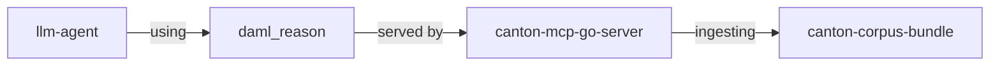

# Development Fund Proposal: canton-corpus-bundle
**Author:** ChainSafe Systems / daml_reason Team
**Status:** Draft
**Created:** 2026-03-24
**Revised:** 2026-09-24
**Proposal Type:** RFP-aligned
**RFP / Roadmap Area:** [RFP 22, Daml Security Standards and Secure Development](https://github.com/canton-foundation/canton-dev-fund/blob/main/2026-2028-strategic-roadmap.md#L238) ([Security, Assurance & Incident Readiness](https://github.com/canton-foundation/canton-dev-fund/blob/main/2026-2028-strategic-roadmap.md#security-assurance--incident-readiness)). Secondary signal only: [RFP 3, Automated Application Management](https://github.com/canton-foundation/canton-dev-fund/blob/main/2026-2028-strategic-roadmap.md#L81).
**Label:** daml-tooling
**Champion:** Need Champion
 
---
 
## Summary
 
This proposal responds to **RFP 22** (Daml Security Standards and Secure Development). It funds `canton-corpus-bundle`: a versioned, openly licensed corpus of production-verified Daml patterns, anti-patterns, and tests. Any correctness gate built on that corpus answers one question: does this code match the stated business intent, checked against the published patterns, and how confident is that answer. When the corpus does not cover the case in front of it, an honest consumer says so and hands off to a human, rather than guessing.
 
The system has four layers, and this proposal only funds one of them:
 

 
1. **llm-agent**: whatever wrote the code, Claude Code, Cursor, Daml Studio, an autonomous agent, anything. Not part of this project.
2. **daml_reason**: the tool interface, an MCP tool that takes a business intent and a piece of Daml code and returns a verdict, a confidence score, and the corpus entries that verdict is grounded in. This is a specification any team can implement against the open corpus; ChainSafe's own implementation is described under `canton-mcp-go-server` below.
3. **canton-mcp-go-server**: ChainSafe's server implementing that interface, the delivery mechanism that gets a corpus-grounded verdict to an agent in practice. This is ChainSafe's product. It is not funded or open-sourced by this proposal.
4. **canton-corpus-bundle**: the corpus itself, verified Daml patterns, anti-patterns, and tests. This proposal funds building it out and publishing it openly, CC-BY-SA 4.0, on a regular release cadence.
ChainSafe operates a hosted, authenticated deployment of `canton-mcp-go-server` under the `daml_reason` name. That commercial deployment is not funded by this grant. What the grant guarantees is that `canton-corpus-bundle` itself, the verified patterns, anti-patterns, and tests, can never be taken hostage by ChainSafe's continued involvement: the data is open regardless of what happens to any single company operating on top of it. It does not guarantee that ChainSafe's specific server is replicable, and that boundary is intentional, not an oversight.
 
This proposal was first submitted to this fund in March 2026 as "Daml Autopilot." The problem it addresses, no systematic, automated correctness check for AI-generated Daml, remains unaddressed by any other public tooling six months later, and the volume of AI-generated Daml reaching production has grown in that interval, not shrunk.

---

## RFP Mapping and Ecosystem Need

**Primary: [RFP 22, Daml Security Standards and Secure Development](https://github.com/canton-foundation/canton-dev-fund/blob/main/2026-2028-strategic-roadmap.md#L238).** The RFP asks for "automated analysis, security-focused linting or static analysis, common vulnerability patterns, review checklists, reference implementations" that help application developers "consistently identify and prevent security weaknesses before Daml packages are deployed or vetted." That is the job of this corpus: a maintained reference of verified patterns and anti-patterns, published as benchmark-gated releases, usable as a pre-deployment checkpoint by any tool. This proposal does not claim to be a full security standard or a substitute for audit. It is the shared reference material and common vulnerability patterns that those later standards and tools can check against.

**Secondary, and weaker: [RFP 3, Automated Application Management](https://github.com/canton-foundation/canton-dev-fund/blob/main/2026-2028-strategic-roadmap.md#L81).** That RFP funds Validator-node tooling for application discovery, review, and security analysis tied to parties vetting or unvetting Daml packages. This proposal does not build that node-level tooling. Corpus verdicts are a signal that such vetting tooling could later consume: a reusable, versioned pre-vetting check, not a one-off IDE convenience.

**Who benefits, and how this drives adoption:**
- **Application developers**, especially teams new to Daml's authorization model or using AI-assisted generation, get a shared, queryable body of verified precedent they can check against before a package is deployed or vetted.
- **Code generators and IDE tools** (Daml Studio and any later equivalent) can consume one open corpus instead of each maintaining closed verification logic.
- **Reviewers** get a triage layer that narrows what reaches human attention, without replacing audit.
- **The network** gets fewer packages reaching vetting with uncaught authorization and party-rights mistakes, because the check sits before deploy and vet, which is the moment RFP 22 names.

Adoption is gated in the milestones themselves: 3 community developers using the corpus by Milestone 2, 5 distinct teams or projects consuming the artifact by Milestone 4, regardless of which server or client they use.

---
 
## Scope: What This Is and Isn't
 
This is not being proposed as a replacement for, or a competitor to, Daml security audit practice. It's worth stating that plainly up front, because the comparison is the natural one to reach for and it's the wrong one.
 
Audit practice today is calibrated to a specific regime: a bounded number of contracts, written by people who understand Daml's authorization model, reviewed by expert auditors before anything reaches a live ledger. That regime has held up well. It has no urgent gap right now.
 
The regime this proposal is for doesn't fully exist yet, which is exactly why it's easy to underweight. As AI agents write more of the Daml reaching production, on behalf of people with no exposure to the authorization model at all, the volume of code entering the pipeline stops being bounded by how fast a qualified human can type. No audit process scales to absorb that, and none is meant to. This proposal is not asking for a faster or cheaper audit. The corpus is a triage layer in front of one: it gives any downstream tool a maintained body of verified precedent to check against, and it is explicit, by design, about the boundary of what it actually covers.
 
Two consequences follow from that framing, and both are load-bearing for how this proposal should be evaluated:
 
**It should never be judged on whether it catches everything an audit would catch.** No corpus-grounded system can make that guarantee, and no version of this proposal, however well-funded, changes that. What it can be judged on is whether it's honest about the difference between what it has verified and what it hasn't.
 
**It should be judged on how the corpus behaves at the edge of its own coverage.** A corpus like this fails in one of two ways: it leaves a gap and says nothing, or it leaves a gap and presents the nearest weak hit as a verified match. The first is a known, disclosed limitation. The second is dangerous, and is the specific failure mode the Design Invariants below are written to make structurally impossible.
 
---
 
## Design Invariants
 
These are properties of the published corpus, not of any one server built on top of it. Invariant 1 is a condition of milestone acceptance, tested against the benchmark suite before each release. Invariants 2 and 3 are properties the artifact must expose so any consumer can fail closed, rather than invent confidence where coverage is thin.
 
1. **Monotonic promotion.** A new corpus version is published only if its retrieval quality does not regress against the prior version's benchmark suite. A candidate update that lowers retrieval quality on any existing benchmark query is rejected before publication, not caught after.
2. **Bounded confidence.** Every published taxonomy node carries enough retrieval evidence that a consumer can tell a grounded hit from an uncovered case. A node that cannot meet the benchmark threshold is labelled as insufficient coverage in the release, not shipped as if it were production-ready.
3. **Deterministic empty recall.** The corpus does not invent a matching pattern where none exists. Weak or empty recall is a first-class benchmark result: those queries must return no strong hit, every time, with no post-hoc score inflation to avoid an empty result. Any gate built on the corpus can then delegate; the funded obligation is that the data makes that choice unavoidable, not optional.
Ground truth for correct Daml is itself about to start moving, most concretely as OpenZeppelin's forthcoming Canton reference implementations are published and revised. Any tool, generator or checker, that works from a frozen snapshot of that standard drifts out of sync with it silently. These three invariants are what let `canton-corpus-bundle` stay synchronized to a moving standard honestly: republished on a fixed cadence, never presenting thin coverage as a verified match, and saying so plainly whenever it can't.
 
---
 
## Relationship to Existing Tools
 
`daml_reason` occupies a different layer of the development workflow than existing AI-assisted Daml tools such as Tenzro's Daml Studio or 5North'S Seaport. Generation and verification are different specializations: one produces code from intent, the other checks code against a maintained body of verified precedent. `daml_reason` does not generate code; it verifies code from any source, including AI-generated Daml from tools like Daml Studio, against `canton-corpus-bundle`, and is explicit about where its own confidence is low. That is the RFP 22 split: generators write packages, this corpus is the shared check that runs before those packages are deployed or vetted.
 
This complementary relationship is not hypothetical. Tenzro has expressed interest in consuming the correctness gate as a downstream check on Daml Studio's output rather than building an equivalent verification layer themselves. That's the intended shape of ecosystem adoption this proposal is built around: one openly maintained corpus, checkable by any Daml generator, rather than each tool maintaining its own closed verification logic.
 
---
 
## Specification
 
### 1. Objective
 
**The problem:** There is currently no openly available, systematically maintained corpus that any tool can check generated Daml against *before Daml packages are deployed or vetted*. AI-assisted coding tools can generate Daml that compiles correctly but contains subtle authorization flaws, incorrect party relationships, or business logic inconsistencies that only manifest in production. Human code review catches some of these issues, but the volume of code entering the pipeline is already outgrowing what manual review can absorb at scale.
 
**The intended outcome:** A versioned, openly licensed corpus of production-verified Daml patterns that any team can query, fork, or build a gate against:
- Cover the core Daml taxonomy with verified patterns, anti-patterns, and tests
- Expose retrieval quality that is independently measurable via a public benchmark suite
- Remain usable without ChainSafe's hosted gate: download a release, point a Chroma instance at it, and query
- Signal coverage gaps honestly: taxonomy nodes without sufficient evidence are labelled as such, not padded
- Ship on a fixed cadence so downstream tools stay synchronized to current ground truth
### 2. System Components
 
**`canton-corpus-bundle`** (primary deliverable): the corpus of verified Daml patterns, anti-patterns, and tests, organized by taxonomy node, published as versioned releases under CC-BY-SA 4.0. Currently operational but small: reliable on basic asset transfer and simple authorization patterns, low-confidence on novel multi-party workflows, governance, and upgrade scenarios. This proposal funds systematic build-out across the full Daml taxonomy:
- Authorization and party rights patterns
- Asset lifecycle patterns (creation, archival, transfer, atomic DvP)
- Multi-party workflow patterns (propose-accept, approval chains, conditional execution)
- Error handling and safety invariants
- Contract governance and upgrade patterns
- Integration patterns
- Known failure modes as verified negative examples
Corpus management follows a structured editorial discipline: taxonomy-driven gap identification, benchmark query sets per taxonomy node, embedding space coverage visualisation, and coverage monitoring as an automatic feedback loop. The full methodology is visible in the open `canton-corpus` repository.
 
**`canton-mcp-go-server`**: ChainSafe's implementation of the `daml_reason` MCP interface, written in Go. The tool operates in two phases: Phase A receives a business intent and retrieves matching patterns from the corpus; Phase B receives the drafted Daml code alongside the intent, optionally with the client's compile result, and returns a verdict. Semantic retrieval over `canton-corpus-bundle` uses vector embeddings with polarity filtering, ensuring anti-patterns and test oracles are excluded from what gets recommended. Compile-result interpretation (reading the client's `succeeded`/`exitCode` hard signal) is live. The semantic alignment gate, scoring how well submitted code actually matches the stated business intent, is in active development, entirely as ChainSafe's own engineering investment and independent of this grant.

`daml_reason`, ChainSafe's hosted deployment of this server, is a convenience layer, not the funded good. It exists so a team can get a corpus-grounded verdict with low latency, integrated auth, and reliability guarantees, without operating any infrastructure themselves. It is one way to consume `canton-corpus-bundle`, not the only way. Any team can instead skip it entirely: pull a versioned release, point a Chroma instance at the manifest, and write their own retrieval and scoring logic against the same open data, inside their own IDE plugin, CI check, or competing product. `canton-mcp-go-server` is not open-sourced and receives no funding from this grant. It is described here only so the boundary between what this grant pays for, the corpus, and what ChainSafe funds on its own, the convenience layer built on top of it, is unambiguous.
 
**`daml_reason` output**: when invoked with a business intent and optional Daml code, the tool returns a structured response. The calling agent is responsible for interpreting the output and determining how to present or act on it; `daml_reason` delivers grounded truth, not editorial judgment.

| Field | Description |
|---|---|
| **Outcome** | `suggest_patterns`, `delegate`, `pass`, `ready_to_compile`, or `fail` |
| **Reasoning** | Human-readable explanation for the outcome, grounded in corpus evidence |
| **Confidence score** | Retrieval similarity score for the corpus patterns returned |
| **Issues** | List of identified problems (plain text; the calling agent interprets severity) |
| **Canonical references** | Pattern hits from the corpus the outcome was compared against, with pinned source URLs |
 
**How the corpus is consumed:** `canton-corpus-bundle` is a versioned GitHub release artifact, a Chroma-compatible vector store plus an oracle index and a manifest. Any team can download a release, point a Chroma instance at it, and query patterns directly, no ChainSafe involvement required. MCP clients, IDE plugins, CI checks, and competitor products are all equally valid consumers of the same open artifact. The semantic contract the corpus exposes is documented in the manifest schema, which is the only interface the funded work commits to.

**IDE and CI/CD integrations** (convenience layer, not the funded good): any MCP-compatible environment can call a `daml_reason`-compatible tool on-demand; any CI system can do the same on pull requests that touch Daml files. Those clients work against whichever implementation the team points them at, including one they run themselves from the open bundle. When compilation is not available client-side, an honest implementation back-delegates rather than attempting a verdict without a compile signal.

**ChainSafe's hosted deployment** (out of scope for this grant): ChainSafe operates a production instance of `canton-mcp-go-server` since March 2026. Teams that want a fully managed, authenticated, SLA-backed endpoint pay ChainSafe for that. Teams that want to self-host can do so from the public bundle release. The funded obligation is that the corpus keeps shipping, under its open license, regardless of what any single company does with it.
 
### 3. Architectural Alignment
 
`canton-corpus-bundle` is consumed at the application layer of the Canton ecosystem. It does not modify the Canton protocol, the ledger, or any existing Canton infrastructure, and introduces no new consensus, ledger, or party-rights semantics. A gate built on it is a pre-deployment check that sits between the developer's environment and the Canton ledger; this proposal funds the data that check runs against, not the check itself.
 
**Alignment with Canton ecosystem priorities:**
- **RFP 22:** Shared reference patterns, anti-patterns, and benchmarked retrieval so developers can identify security weaknesses before packages are deployed or vetted
- **Developer experience:** Lowers the barrier to safe Daml development, particularly for teams new to the Canton model or using AI-assisted code generation
- **Production safety:** Addresses a real gap in tooling for teams deploying Daml to production Canton networks, ahead of the volume growth described above, not in reaction to it
- **Ecosystem growth:** An open corpus means the verification layer's actual substance, the verified patterns and their provenance, is something the whole developer ecosystem can build on, not something any team has to trust a single company to maintain indefinitely
- **Autonomous agent readiness:** As AI agents generate more Daml, a deterministic, corpus-grounded correctness layer becomes infrastructure, whichever tool ultimately performs the check
### 4. Backward Compatibility
 
*No backward compatibility impact.* `daml_reason` is an independent service. It does not modify, wrap, or depend on any existing Canton production contracts or infrastructure. It reads Daml source code as input and returns a structured assessment. Integration is entirely opt-in at the developer or team level.
 
---
 
## Licensing and Public Good Commitment
 
Modelled on the structure used in the OpenZeppelin Canton ecosystem proposal.
 
- **`canton-corpus-bundle`**: CC-BY-SA 4.0, published as versioned releases to a public repository, starting with the Milestone 1 delivery. This is the funded public good.
- **Benchmark suite, coverage audit scripts, and embedding visualisation tooling** (the methodology used to validate the corpus, not the gate itself): Apache 2.0, so corpus quality claims are independently checkable by anyone, not just verifiable by trusting ChainSafe's own reporting.
- **`canton-mcp-go-server`**: ChainSafe's product. Not open-sourced, not funded by this grant. It is the convenience layer that delivers corpus-grounded verdicts to an agent, with authentication and SLA-grade hosting on top.
This split bounds the obligation this grant creates to the corpus and its open publication, not to indefinite unfunded maintenance of a commercial service. If ChainSafe's involvement ends for any reason, the published corpus remains forkable and usable under its stated license, and the benchmark tooling that validates it remains independently runnable, which is the specific risk the Dev Fund's "reduces reliance on any single organization" principle is meant to address. It addresses reliance on the data, not on ChainSafe's specific server; that's a narrower guarantee than an open-core split would offer, and it's the one being proposed here.
 
---
 
## Milestones and Deliverables

Each milestone is a corpus release. The gate that keeps each release honest is the benchmark suite; the funded obligation is to pass it before publishing, not to pass it once. ChainSafe's server is not a deliverable in any milestone.

### Milestone 1: First Corpus Release
- **Estimated Delivery:** Week 6
- **Deliverables / Value Metrics:**
  - `canton-corpus-bundle` v1 published under CC-BY-SA 4.0, covering all taxonomy nodes with a minimum of 5 verified documents per node
  - Benchmark query suite (≥3 positive and ≥1 negative query per taxonomy node) published under Apache 2.0
  - Embedding space visualisation and coverage audit tooling published under Apache 2.0
  - Benchmark results on record: ≥0.75 retrieval confidence on 90% of queries

### Milestone 2: Second Release and Adoption Signal
- **Estimated Delivery:** Week 10
- **Deliverables / Value Metrics:**
  - `canton-corpus-bundle` v2 published, with documented taxonomy gaps closed since v1
  - Coverage delta report: which nodes improved and by how much
  - Quick-start guide for consuming `canton-corpus-bundle` directly, independent of any server
  - At least 3 Canton community developers using the corpus in active development, with documented feedback

### Milestone 3: Third Release and Contribution Process
- **Estimated Delivery:** Week 16
- **Deliverables / Value Metrics:**
  - `canton-corpus-bundle` v3 published
  - Documented contribution process: how external teams propose, review, and promote a new pattern into the corpus
  - Monotonic promotion demonstrated: v3 passes the full benchmark suite without regressing any v2 result

### Milestone 4: Sustained Cadence and Demonstrated Ecosystem Adoption
- **Estimated Delivery:** Week 22
- **Deliverables / Value Metrics:**
  - `canton-corpus-bundle` v4 published, demonstrating a sustained release cadence across the project window
  - Demonstrated ecosystem adoption: at least 5 distinct teams or projects consuming `canton-corpus-bundle` in an active pipeline, regardless of which server or client they use to do so
  - Public technical write-up on the corpus methodology, covering how patterns are sourced, validated, and promoted
---
 
## Acceptance Criteria
 
The Tech & Ops Committee will evaluate completion based on:
- Four versioned `canton-corpus-bundle` releases published on schedule, each under CC-BY-SA 4.0, independently forkable and usable without ChainSafe's server
- Each release accompanied by benchmark results on record, showing retrieval quality at or above the specified threshold (90% of queries at ≥0.75 confidence)
- Monotonic promotion demonstrated: no release regresses benchmark quality from the prior one
- Corpus coverage expanded across the full Daml taxonomy, documented in the coverage reports that accompany releases after v1
- Contribution process documented and publicly available by Milestone 3
- Demonstrated ecosystem adoption: at least 5 teams or projects using the corpus artifact by Milestone 4
---
 
## Funding
 
**Total Funding Request:** 621,000 CC
 
This covers six months of fully-loaded team costs for the corpus build-out and its open publication pipeline: one senior ML engineer with production RAG and Daml domain expertise ($150,000/year), 0.5 FTE DevOps (€48,000/year), and AI tooling (€6,000/year), totalling approximately $90,000 over the project duration. CC amounts are calculated at the rate prevailing at submission ($0.145 USD/CC), giving 621,000 CC total, paid in four equal instalments of 155,250 CC on milestone completion. None of this funding is applied to `canton-mcp-go-server`, ChainSafe's hosted deployment, or its SLA infrastructure, which ChainSafe funds and operates independently.
 
### Payment Breakdown by Milestone
 
| Milestone | Deliverable | USD | CC Payment |
|---|---|---|---|
| Milestone 1 | First corpus release, benchmark infrastructure, coverage tooling | ~$22,500 | 155,250 CC |
| Milestone 2 | Second corpus release, coverage delta report, quick-start guide | ~$22,500 | 155,250 CC |
| Milestone 3 | Third corpus release, contribution process documented | ~$22,500 | 155,250 CC |
| Milestone 4 | Fourth corpus release, sustained cadence, ecosystem adoption demonstrated | ~$22,500 | 155,250 CC |
| **Total** | | **~$90,000** | **621,000 CC** |

Each milestone carries equal weight: one corpus release with its accompanying benchmark results and documentation. CC amounts are equal (155,250 per milestone, 621,000 total) at the rate prevailing at submission ($0.145 USD/CC).
 
### Volatility Stipulation
 
The project duration is under 6 months. The grant is denominated in fixed Canton Coin at the rate prevailing at submission. Should the CC/USD rate decline materially before remaining milestones are paid out, the real value of those payments may be insufficient to cover the stated team costs. In that event, the implementing entity reserves the right to request renegotiation of remaining milestone amounts to reflect actual costs. Should the project timeline extend beyond 6 months due to committee-requested scope changes, all remaining milestones must be renegotiated regardless of rate movement.
 
---
 
## Co-Marketing
 
Co-marketing runs across the full project, not just at the end: each corpus release is a concrete, independently usable artifact and a natural moment for joint communication.

- **Milestone 1:** Announcement of the first open `canton-corpus-bundle` release, including what's in it, how to use it, and how to follow future releases
- **Milestone 2 and 3:** Short release notes and ecosystem comms for each new bundle version, highlighting coverage improvements and new taxonomy nodes
- **Milestone 4:** Full technical write-up on the corpus methodology and a case study on patterns sourced and validated over the project, written for a Daml developer audience; broader developer ecosystem promotion targeting Canton-connected institutions
---
 
## Motivation
 
The Canton ecosystem faces two compounding pressures. Institutions are deploying increasingly sophisticated Daml contracts, multi-party workflows, novel financial instruments, complex integration layers. Simultaneously, AI-assisted code generation is accelerating the volume of Daml reaching production review. Neither trend is slowing. The tooling gap they expose is not theoretical: authorization flaws and business logic inconsistencies do not surface at compile time, the volume of code entering the pipeline is already outgrowing what manual review can absorb at scale, and there is currently no openly available, systematically maintained corpus that any tool can check generated Daml against.
 
There is a third pressure specific to this moment: ground truth for what correct Daml looks like is itself about to start moving. As standard libraries form, OpenZeppelin's forthcoming reference implementations foremost among them, patterns will be added, corrected, and deprecated over time. Any tool, generator or checker, that works from a frozen snapshot of that standard drifts out of sync with it silently. `canton-corpus-bundle` is versioned specifically against that evolving ground truth and republished on the cadence described above, so downstream consumers are checked against what is current, not against what was current when they last updated their own tooling. That synchronization role, kept honest by the Design Invariants, is the core of what this proposal funds.
 
An open corpus, embedded into the standard Daml workflow, changes the economics of this problem for the whole ecosystem, not only for ChainSafe's own tooling. This does not replace expert review. It makes expert review more targeted, and it lets any team, including ones building their own gate or IDE integration on top of the same open data, ground their tooling in the same verified patterns rather than duplicating the curation work independently.
 
There is a second benefit worth naming explicitly. Twelve years of Daml documentation, SDK changelogs, reference implementations, and legacy integration guides exist in a form that is technically complete but practically unnavigable. New developers onboarding to the network today face a documentation surface too large to read and too poorly indexed to search effectively. Building the corpus is, by definition, the act of distilling that accumulated knowledge into something openly queryable. Every gap identified is a gap in accessible Daml knowledge. Every document added, and published, is a piece of that knowledge made findable and forkable by the whole ecosystem, independent of any single company's continued involvement.
 
ChainSafe's `daml_reason` deployment is one product built on top of this open corpus, funded and operated independently of this grant. We expect and welcome others to build their own tools against the same open data.
 
---
 
## Rationale
 
**Why a corpus-grounded approach rather than pure rule-based static analysis?**
Rule-based analysis catches known anti-patterns but cannot assess whether code correctly implements a given business intent. A contract can pass all rule checks and still model the wrong thing. Corpus-grounded semantic retrieval lets any tool, gate, or IDE plugin compare submitted code against known-correct implementations of similar patterns, surfacing deviations that rules alone cannot detect.
 
**Why not use a frontier language model, or a fine-tuned model, directly?**
Frontier models have seen Daml code during training, undifferentiated from broken examples, outdated patterns, and forum posts where someone was asking why their code was wrong. Fine-tuned code-generation models bake a fixed set of examples into opaque model weights: not updatable without retraining, and not traceable to a specific source pattern. An open, versioned corpus is auditable, updatable without retraining, and lets any tool built on it, including a fine-tuned generator's own output, be checked against a calibrated confidence score and an honest low-confidence signal when coverage is thin.
 
**Why is the server not open, if the corpus is?**
The corpus is what makes the verification claim checkable: anyone can inspect what "verified pattern" means, dispute an entry, or build against it. The server is where ChainSafe's own engineering investment goes into making that corpus usable in practice for an agent in real time: authentication, latency, reliability. Keeping it as ChainSafe's product doesn't restrict the public good the grant funds, since the corpus is what any alternative implementation would actually need, and nothing in this proposal stops another team from building their own server against the same open data. The grant guarantees the data can't be taken hostage by any single company's continued involvement. It does not guarantee that ChainSafe's specific implementation of the gate is replicable, and that boundary is deliberate: it's the difference between funding a commons and funding a competitor to ChainSafe's own product.
 
**Why the MCP interface?**
MCP is the emerging standard for tool integration in AI-assisted developer environments. Implementing the gate as an MCP server means it integrates natively with Cursor, Claude Code, and any other MCP-compatible environment without custom integration work, and positions it correctly as verification infrastructure callable by autonomous agents, not only by human developers.